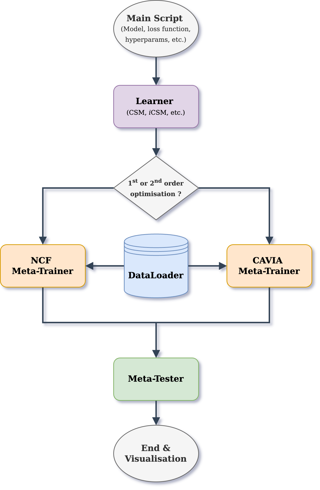

# SelfMod: A Contextual Self-Modulation Library

<p align="center">

</p>

**SelfMod** is a library for implementing **Contextual Self-Modulation (CSM)** techniques in deep learning. SelfMod is designed to make your meta-learning tasks adaptable, scalable, and intuitive, whether you're doing 1st or 2nd order optimization.

---

## 🚀 **Key Features**

1. **Dynamic Context Adaptation:** Effortlessly integrate CSM into your projects to propagate information across environments.
2. **Modular Design:** Built around four extensible modules for flexibility and scalability:
   - **DataLoader:** Seamlessly manage and preprocess datasets.
   - **Learner:** Define models, loss functions, and context modulation strategies.
   - **Trainer:** Implement training pipelines with first- or second-order optimization.
   - **VisualTester:** Visualize and evaluate results across tasks and environments.
3. **Plug-and-Play:** Use pre-implemented CSM techniques (like iCSM) or customize them for your specific needs.
4. **Extensibility:** Add new datasets, models, or visualization tools effortlessly.
5. **Supports NCF and CAVIA:** Integrate seamlessly with state-of-the-art meta-learning frameworks.

---

## 📄 **How It Works**

### **Modular Architecture**
SelfMod's design ensures ease of use while offering the flexibility to adapt to your unique research needs:

1. **DataLoader:**
   - Handles data ingestion and preprocessing.
   - Supports multi-task and multi-modal datasets.

2. **Learner:**
   - Encapsulates the model and loss function.
   - Includes pre-implemented CSM strategies and customizable options.

3. **Trainer:**
   - Manages training loops with hyperparameter tuning.
   - Supports meta-training for NCF and CAVIA frameworks.

4. **VisualTester:**
   - Enables meta-testing and visualization of results.
   - Provides insightful metrics and plots for evaluation.

### **Example Workflow**


Example Code             |  Flowchart
:-------------------------:|:-------------------------:
```python
    from selfmod import DataLoader, Learner, Trainer, VisualTester

    # Load your dataset
    loader = DataLoader(dataset="path/to/data")

    # Define your model and loss
    learner = Learner(model=my_model, contexts=my_ctx, loss_fn=my_loss_fn)

    # Train your model
    trainer = Trainer(learner=learner, optimizer=my_optimiser)
    trainer.meta_train(dataloader=loader, epochs=500)

    # Test and visualize your results
    tester = VisualTester(trainer=trainer)
    tester.evaluate()
    tester.visualize()
``` |  

---

## 📚 **Papers Using SelfMod**
This space is dedicated to showcasing cutting-edge research leveraging SelfMod:

- [Placeholder for Paper 1]
- [Placeholder for Paper 2]
- [Placeholder for Paper 3]

If your paper uses SelfMod, feel free to create a pull request and add your work here!

---

## 🔧 **Installation**
SelfMod can be installed via cloning the repository and installing manually:
```bash
git clone https://github.com/ddrous/self-mod.git
cd self-mod
pip install -e .
```

---

## 🌟 **Why Choose SelfMod?**

- **Generalization Across Contexts:** Handle varying modalities, task dimensions, and data regimes effortlessly.
- **Research-Oriented:** Designed with meta-learning researchers in mind, providing tools to push the boundaries of adaptability.
- **Community-Driven:** Join an active community of developers and researchers exploring the frontiers of contextual modulation.

---

## 👥 **Contributing**
Contributions are welcome! If you'd like to report issues, suggest features, or contribute code, please refer to our [contributing guidelines](CONTRIBUTING.md).

---

## 📫 **Contact**
For questions, feedback, or collaboration opportunities, feel free to reach out via [email@example.com](mailto:email@example.com).

---

## 🔗 **License**
SelfMod is licensed under the MIT License. See [LICENSE](LICENSE) for more details.

---

Thank you for using SelfMod! Happy modulating! 🎉
